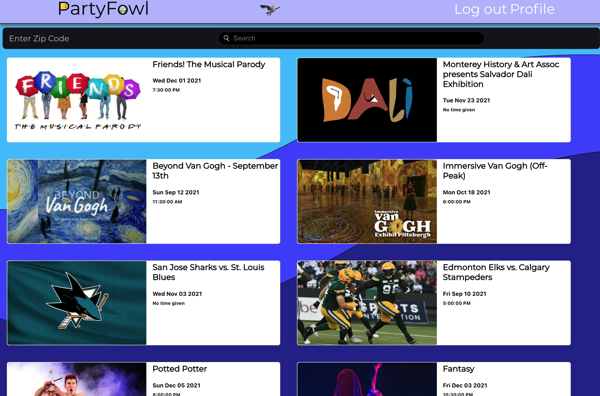
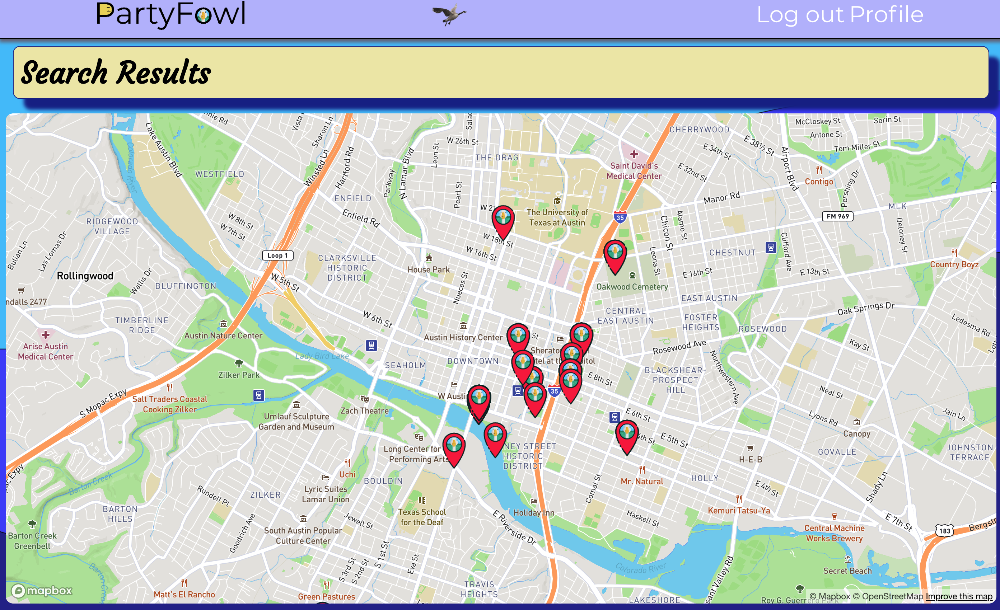
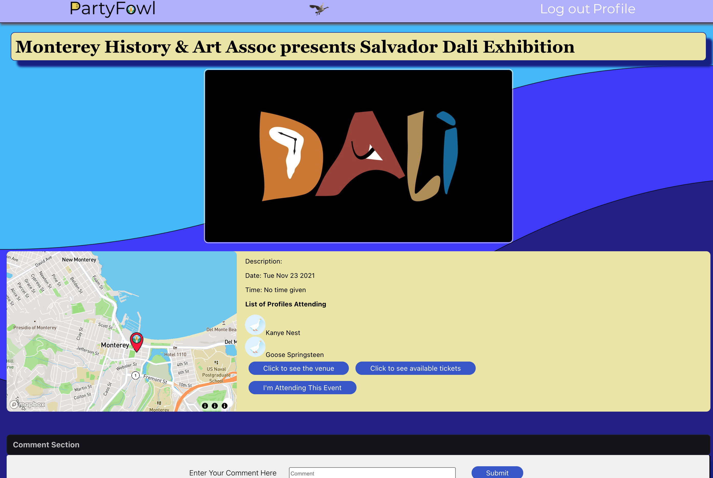
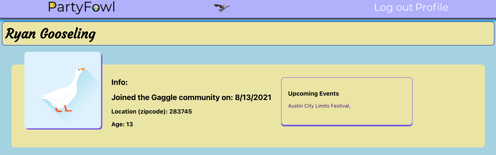

# PartyFowl :tada:

Some catchy introduction

---
## :sparkles: [Check It Out Here!](https://partyfowl.herokuapp.com/)
---
## :partying_face: How Does It Work? 

 

---
## :egg: The Journey 
- [Pitch Deck](https://docs.google.com/presentation/d/1bQ29lyAS3Sh1EwHPWaYkkN7ltEh5ggD-Cd8myElIi1k/edit?usp=sharing)
- [Trello Board](https://trello.com/b/JQFN0NHt/partyfowl)
- [Wireframes](https://whimsical.com/wireframe-EYSLtdCCMTEAnC2rkBGgYB)
- [Entity Relationship Diagram (ERD)](https://whimsical.com/erd-9fAMAuyj7CswdHDDe1K1VW)
---
## :computer: Features
- AJAX 
- Full CRUD operations
- JSON Web Token (JWT) Authentication
- Consumes third-party API data (TicketMaster, MapBox, GeoHash)
---
## :zap: Technologies Used 
- CSS
- Express
- Git / GitHub
- HTML
- JavaScript
- MongoDB
- Mongoose
- Node.js
- Postman
- React.js
---
## :ice_cube: IceBox (Next Steps) 
- [ ] Display photo/image carousel on Launch, Event Details, and Profile pages
- [ ] Add user ability to upload their own profile image
- [ ] Image upload without URL input
- [ ] Grabbing user location given user permission 
- [ ] Ability to favorite or unfavorite events the user is interested in
- [ ] Add loading animations
- [ ] Redirect to login page when user tries to interact but is not authorized
- [ ] Additional styling
- [ ] Ability to interact with other users (i.e. followers, viewing profiles)
- [ ] Mailing feature to send notifications
- [ ] Messaging features
---
## :bird: The Team: SEI-Gulls 
- **Witte Crosby** :technologist: Scrum Master, API Lead | [GitHub](https://github.com/jwcrosby), [LinkedIn](https://www.linkedin.com/in/wittec/)
- **Gerardo Cazares** :technologist: Designer | [GitHub](https://github.com/geedtd), [LinkedIn](https://www.linkedin.com/in/gerardocazares/)
- **Jimmy Erickson** :technologist: Database Manager | [GitHub](https://github.com/JImmyJImmy0), [LinkedIn](https://www.linkedin.com/in/james--erickson/)
- **Christine Wei** :woman_technologist: GitHub Commander, Documenter | [GitHub](https://github.com/christinew2), [LinkedIn](https://www.linkedin.com/in/christinew2/)

---
## :yellow_heart: Attributions & Shoutouts
Special shoutout to our instructors!!

Icons from www.flaticon.com. 
